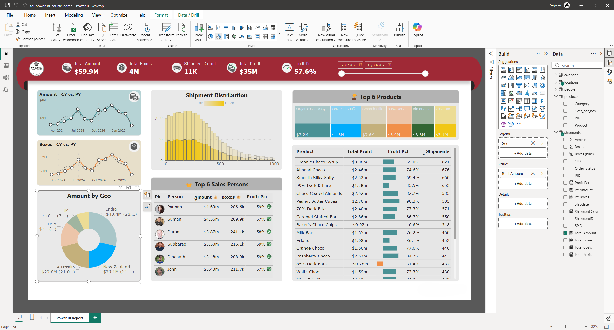

# 🍫 Chocolate Sales Analysis Dashboard – Power BI

This project presents an interactive **Power BI dashboard** designed to analyze chocolate sales across regions, product categories, and salespersons.  
The dashboard transforms raw shipment data into meaningful insights, enabling clear visibility into business performance using dynamic KPIs and visuals.

---

## 📸 Dashboard Snapshot

---

## 🚀 Features & Insights

### **1️⃣ Key KPIs**
- **Total Amount:** $59.9M  
- **Total Boxes Shipped:** 4M  
- **Shipment Count:** 11K  
- **Total Profit:** $35M  
- **Profit Percentage:** 57.6%

---

## 📊 Dashboard Visuals

### **📈 Trend Analysis (CY vs PY)**
- Amount comparison between *Current Year vs Previous Year*  
- Boxes shipped comparison  
- Helps in identifying seasonal growth and decline patterns.

### **📦 Shipment Distribution**
- Distribution of shipments across different quantity bins  
- Highlights volume patterns and sales behavior.

### **🌍 Geographic Insights**
- Country-wise contribution to total amount  
- Top-performing regions include India, New Zealand, and Australia.

### **🏆 Top 6 Salespersons**
- Ranking based on Amount, Boxes sold, and Profit Percentage  
- Provides insights for performance evaluation.

### **🍬 Top 6 Products**
- Product-wise profit and performance  
- Identifies high-profit and low-profit items for strategic planning.

### **📄 Detailed Product Table**
- Product Name  
- Total Profit  
- Profit Percentage  
- Shipments  
- Visual bars included for quick comparison  

---

## 🛠️ Tools Used
- **Power BI Desktop**
- **Data Transformation (Power Query)**
- **DAX for Calculations**
- **CSV/Excel-based Data Source**
